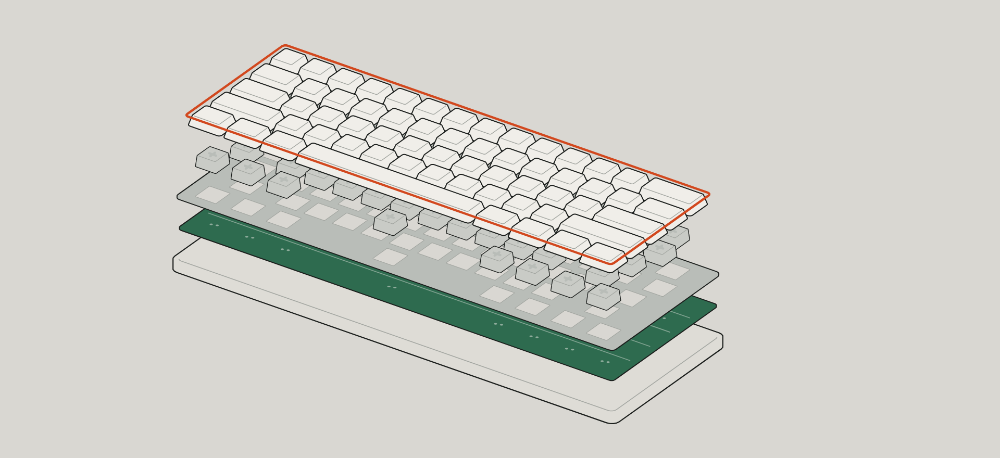

# Exploded

An exploded-view parts catalog for a 60% mechanical keyboard, built with Uno Platform. A slider pulls the five layers of the build (case, PCB, plate, switches, keycaps) apart along the build axis; each layer has a numbered callout, a row in the parts table with SKU, price and stock status, and can be added to a build with a running total.



`shots/stage-*.png` are off-screen renders of the stage at separation 0, 50 and 100 (`tools/StageRender`); `shots/app-assembled-linux.png` is the app running on Linux under Xvfb; `shots/plate-assembled.png` is the earlier flat-sheet stage.

## What's in it

| Path | Purpose |
|---|---|
| `Exploded/Exploded/` | The app (Uno single project, one page) |
| `Exploded/Exploded/Catalog/` | `Part` record, `IPartsCatalog` and a hardcoded in-memory kit of five parts |
| `Exploded/Exploded/Stage/` | The isometric camera and solids (`Iso.cs`, ported from Hairline), the explode (`Explode.cs`: lifts, callout fade, leader lines), key layout table, and the SkiaSharp plate renderer |
| `Exploded/Exploded/Presentation/PartRow.cs` | Observable row object for the parts table (selected / in build) |
| `Exploded/Exploded/Themes/Tokens.xaml` | Color, type, spacing and shape tokens |
| `Exploded/EXPLODED-SPEC.md` | Architecture, design and interaction brief plus implementation plan |
| `Exploded/tools/` | `Capture-Window.ps1` (Windows window capture), `IsoParity` (proves `Iso.cs` matches Hairline's kernel number for number), `StageRender` (off-screen renders of the stage) |
| `Exploded/shots/` | Screenshots |

## Tech

- Uno Platform single project, `Uno.Sdk` 6.8.0-dev.12 (`global.json`), target `net10.0-desktop` only
- `UnoFeatures`: `SkiaRenderer; Mvux`
- The stage is a single `SKCanvasElement` (`PlateCanvas`). The five parts are isometric solids: each is the hull of two rounded rings (its foot and its top) with one crease inside the top edge, built with the geometry of [Hairline](https://github.com/lucasmarkes/hairline) (`Stage/Iso.cs`, an arithmetic-for-arithmetic port of its `core/iso.ts`, MIT). The camera is orthographic, so lifting a layer is a screen translation: each layer is recorded once into an `SKPicture` at its assembled height and replayed shifted, and moving the slider is one invalidation. The spec explains why XAML `Path` layers were dropped (per-frame cost on the UI thread).
- Hit testing runs the pointer back through the camera onto each layer's top plane (`Iso.Unproj`) and tests the layer's footprint in world units.
- Separation drives the leader lines, callout fade and stage hint through `x:Bind` function bindings on `MainPage`.
- Selection and build state are plain code-behind over five `PartRow` objects. The spec plans an MVUX `BuildModel`; it is not in the code yet.
- Fonts: static IBM Plex Sans, Sans Condensed and Mono TTFs in `Assets/Fonts`.
- Central package management is on; `Directory.Packages.props` is empty (Uno implicit packages).

## Run it

Requires the .NET 10 SDK.

```
dotnet build Exploded/Exploded.sln
dotnet run --project Exploded/Exploded/Exploded.csproj -f net10.0-desktop
```

The spec notes that with a dev-channel Uno.Sdk a Debug build launched without the dev server may show no window.

## Status

Prototype. The plate, explode slider, callouts, two-way selection between stage and table, and add/remove with a build total are implemented. The narrow layout and MVUX model from the spec are not.
