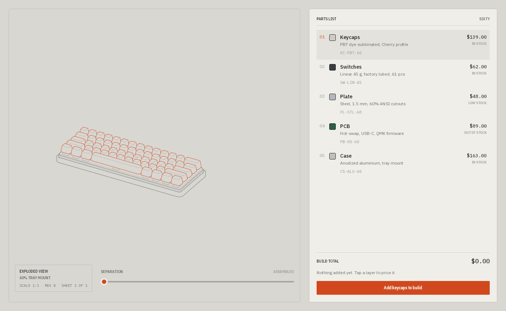
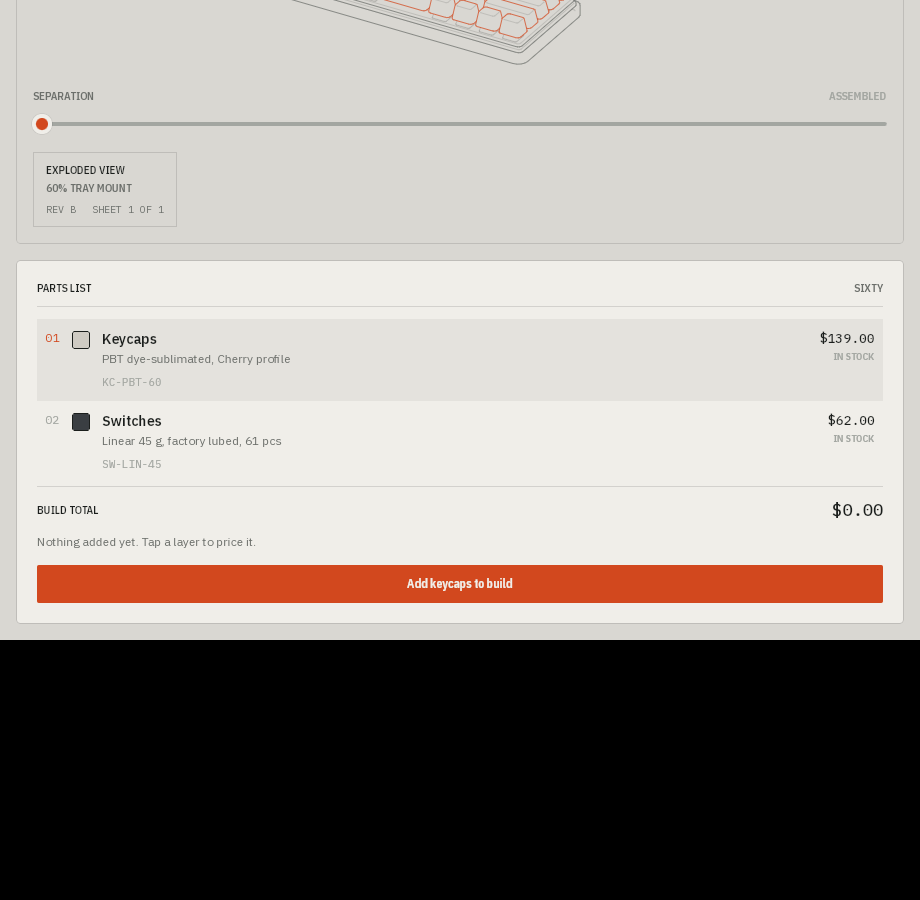

# Exploded

An exploded-view parts catalog for a 60% mechanical keyboard, built with Uno Platform. A slider pulls the five layers of the build (case, PCB, plate, switches, keycaps) apart along the build axis; each layer has a numbered callout, a row in the parts table with SKU, price and stock status, and can be added to a build with a running total.



## What's in it

| Path | Purpose |
|---|---|
| `Exploded/Exploded/` | The app (Uno single project, one page) |
| `Exploded/Exploded/Catalog/` | `Part` record, async `IPartsCatalog` and a hardcoded in-memory kit of five parts |
| `Exploded/Exploded/Stage/` | Explode math (`SheetMatrix`, callout fade, leader lines), key layout table, and the SkiaSharp plate renderer |
| `Exploded/Exploded/Presentation/` | MVUX `BuildModel`, `BuildList` / `PartAction` / `PartLine` records, and two small converters |
| `Exploded/Exploded/Themes/Tokens.xaml` | Color, type, spacing and shape tokens |
| `Exploded/Exploded.Tests/` | NUnit tests for `BuildModel` and the build records |
| `Exploded/Exploded/RuntimeTests/` | In-app UI tests (Uno runtime-tests engine), built only with `-p:RuntimeTests=true`; see its README |
| `Exploded/EXPLODED-SPEC.md` | Architecture, design and interaction brief plus implementation plan |
| `Exploded/tools/Capture-Window.ps1` | Windows script that captures a running app window to PNG |
| `Exploded/shots/` | Screenshots |

## Tech

- Uno Platform single project, `Uno.Sdk` 6.8.0-dev.12 (`global.json`), targets `net10.0-desktop` plus a plain `net10.0` that exists so the test project can reference the app
- `UnoFeatures`: `SkiaRenderer; Mvux`
- The stage is a single `SKCanvasElement` (`PlateCanvas`). Each sheet is recorded once into an `SKPicture` and replayed under its own matrix, so moving the slider is one invalidation. The spec explains why XAML `Path` layers were dropped (per-frame cost on the UI thread).
- Separation drives the leader lines, callout fade and stage hint through `x:Bind` function bindings on `MainPage`.
- Kit, selection and build live in the MVUX `BuildModel`; the generated `BuildViewModel` is the page's DataContext. The parts table is a `FeedView` over `Lines` with progress, error (Retry) and none states. Separation stays out of MVUX and on `x:Bind`, because it changes on every pointer move.
- Code-behind keeps view-only work: the Skia stage, the callout bubbles, and keyboard focus. Each selection or build change re-emits the rows and the table replaces the changed ones, so the page re-focuses the row the user was on when its replacement loads.
- Fonts: static IBM Plex Sans, Sans Condensed and Mono TTFs in `Assets/Fonts`.
- Central package management is on. The app uses Uno implicit packages; `Directory.Packages.props` pins only the test packages (NUnit, NUnit3TestAdapter, Microsoft.NET.Test.Sdk).

## Run it

Requires the .NET 10 SDK.

```
dotnet build Exploded/Exploded.sln
dotnet run --project Exploded/Exploded/Exploded.csproj -f net10.0-desktop
dotnet test Exploded/Exploded.Tests
```

Awaiting an MVUX feed takes one value from a fresh subscription, and state writes propagate asynchronously, so a read straight after a write can return the old value. The model tests read after writes through an `Eventually` helper that waits for the expected value.

The spec notes that with a dev-channel Uno.Sdk a Debug build launched without the dev server may show no window.

## Status

Prototype. Implemented:

- The plate, explode slider, callouts, two-way selection between stage and table, add/remove with a build total.
- Narrow layout below 1000 px: stage on top at a capped height, slider and title block under it, parts table filling the rest with the total and Add pinned at the bottom. Below 600 px wide the title block is dropped so the table keeps a full row. The desktop window floor is 360 x 640 (it exists to keep the Win32 render thread away from degenerate sizes, see `App.xaml.cs`).
- Keyboard: rows are tab stops, focusing a row selects it, Up/Down move between rows, Enter/Space add or remove the focused part. Rows announce number, name, spec, price, stock and build state to screen readers.

- MVUX `BuildModel` with `FeedView` loading, error and none states.

- Unit tests for `BuildModel`, `BuildList` and `PartAction`.
- In-app UI tests for selection, the build flow and keyboard focus, run headless under Xvfb.
- The build total counts to each new value (280 ms, EaseSmooth) through the `CountUp.Amount` attached property, and sets at once when OS animations are off.


